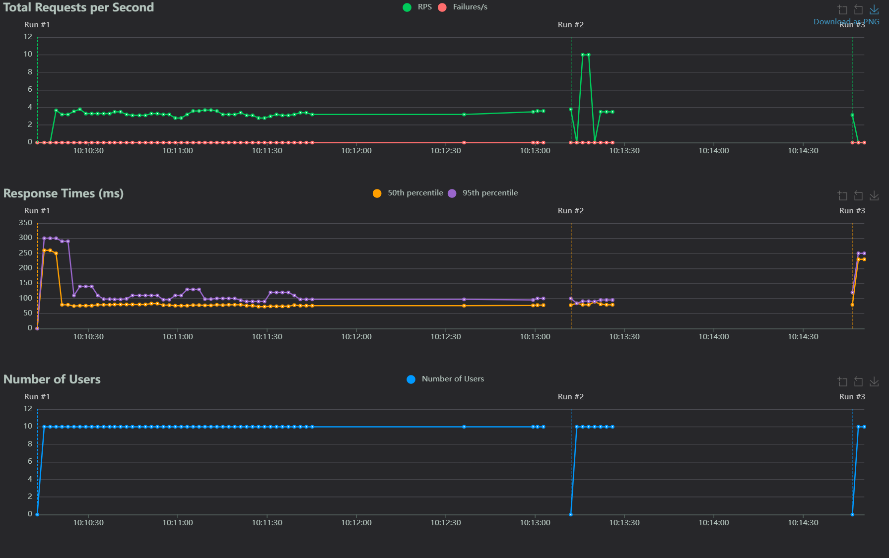
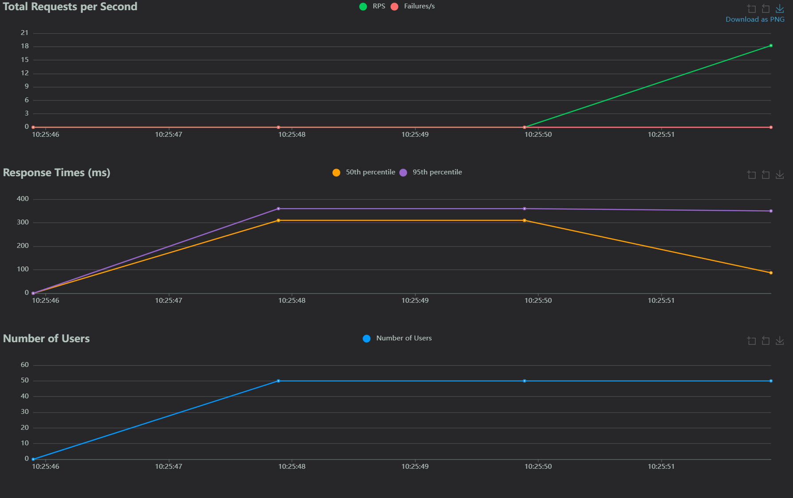
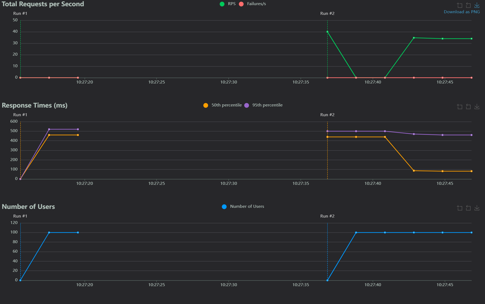

---

## 🛠 Ferramentas Utilizadas

- **API Testada**: [JSONPlaceholder](https://jsonplaceholder.typicode.com/) (API pública para testes)
- **Ferramenta de Teste de Carga**: [Locust](https://locust.io/)
- **Linguagem de Programação**: Python 3
- **Frontend**: HTML/CSS/JS simples para consumir o endpoint `/todos`

---

## 🚀 Objetivo do Projeto

1. **Testar o Endpoint**: Realizar requisições GET ao endpoint `/todos/1` da API JSONPlaceholder.
2. **Simular Carga**: Utilizar o Locust para simular diferentes cenários de tráfego, gerando usuários simultâneos e avaliando o tempo de resposta e a taxa de sucesso.
3. **Monitoramento e Análise**: Observar como a API se comporta em cenários de carga variada, identificando limites e possíveis gargalos de desempenho.

---

## 🐍 Configuração do Locust

O arquivo principal para o teste de carga é o `locustfile.py`, localizado na pasta `/locust`. Ele realiza requisições GET no endpoint `/todos/1` para testes realizados:
Cenário Leve: 10 requisições por segundo.
Cenário Moderado: 50 requisições por segundo.
Cenário Intenso: 100 requisições por segundo.
.

### Código do `locustfile.py`:

```python
from locust import HttpUser, task, between

import random

class APIUser(HttpUser):
    wait_time = between(1, 5)

    @task
    def get_todo(self):
        
        with self.client.get(f"/todos/1", catch_response=True) as response:
            if response.status_code == 200:
                response.success()
            else:
                response.failure(f"Status code: {response.status_code}")
```

Gráfico 10 requisições

Gráfico 50 requisições

Gráfico 100 requisições
